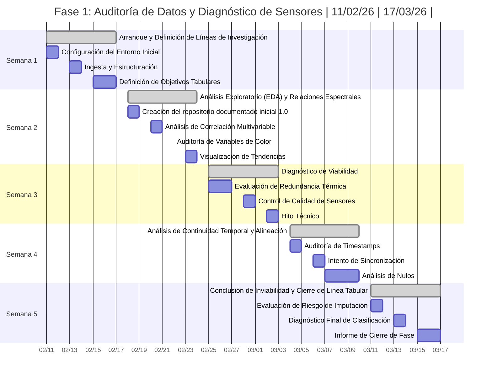
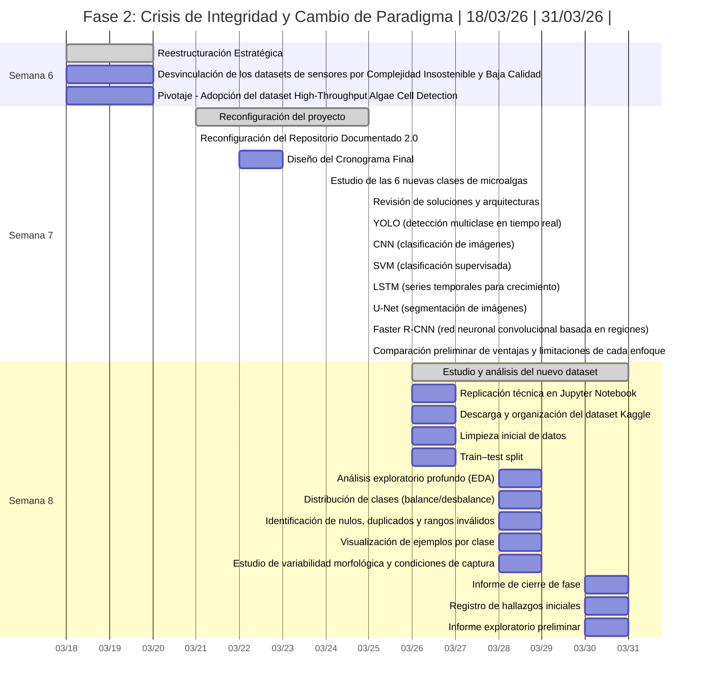
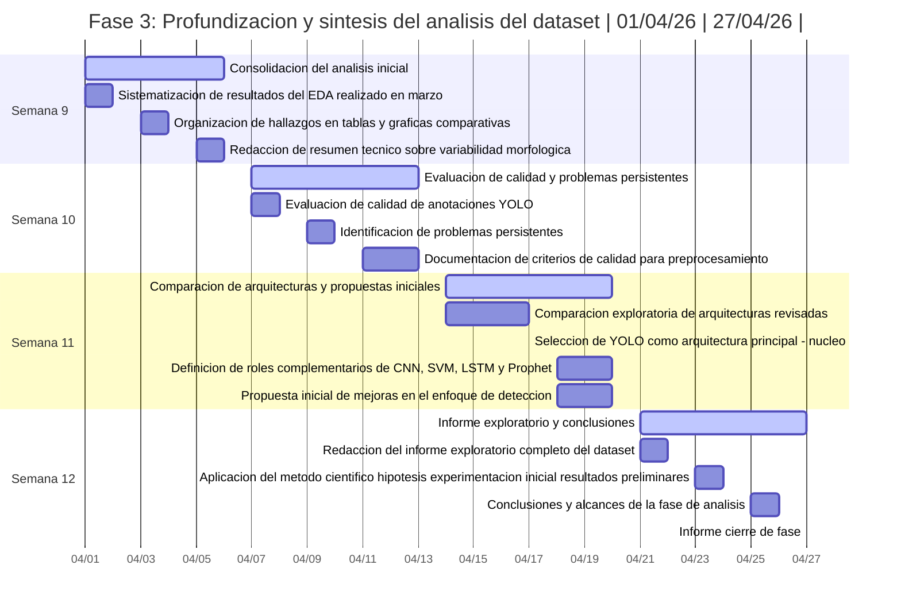
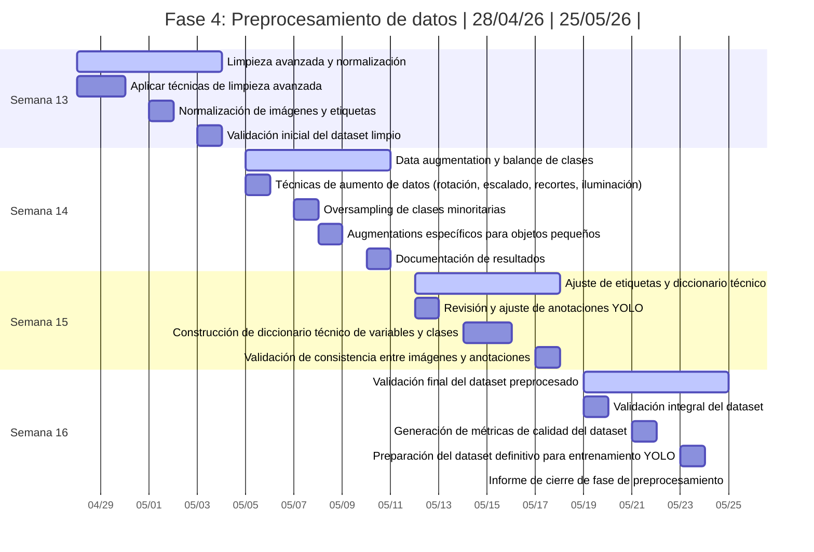
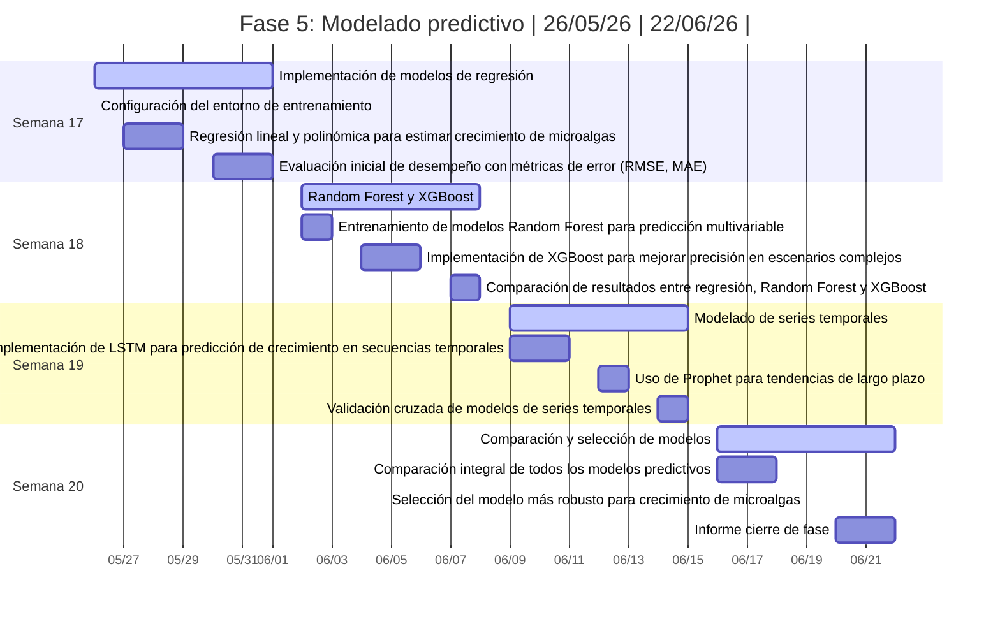
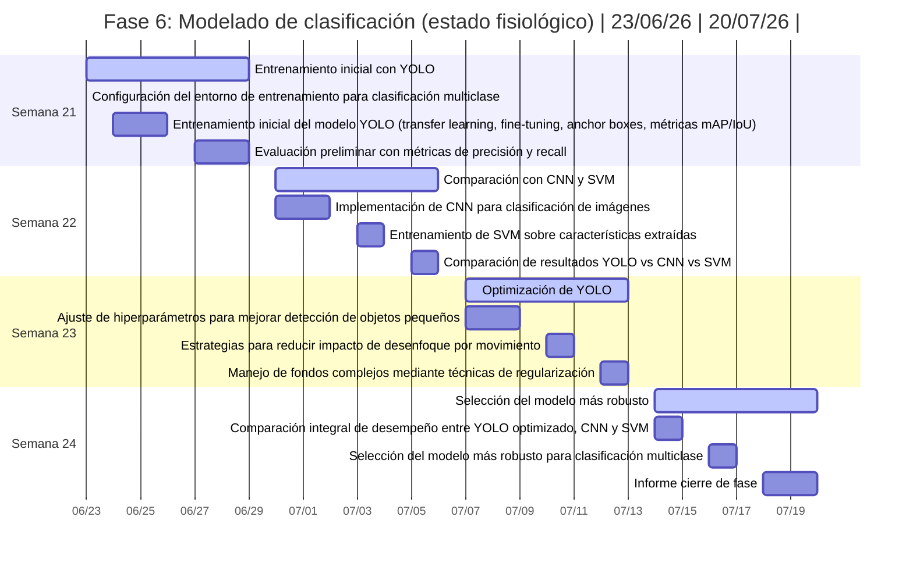
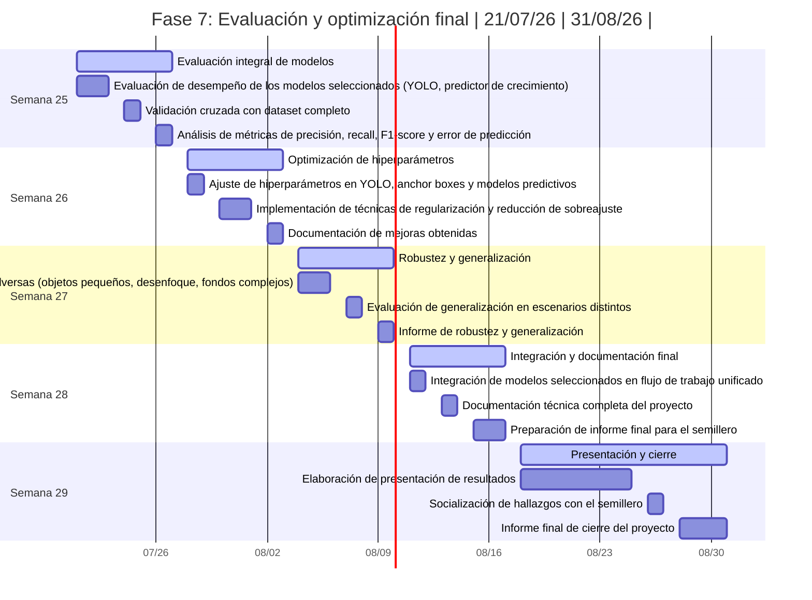

# Semillero de Investigación 2026
Repositorio del semillero enfocado en proyectos de ciencia de datos y machine learning aplicados a análisis de datos biológicos.

## Descripción

Actualmente el proyecto incluye un notebook de análisis preliminar para el dataset **High-Throughput Algae Cell Detection** (formato YOLO), con exploración de estructura, carga de anotaciones y visualización de resultados.

## Cronograma del Proyecto










## Configuración del Entorno

### Requisitos Previos

- Python 3.8 o superior
- pip (gestor de paquetes de Python)
- Jupyter Notebook
- Cuenta de Kaggle con acceso al dataset
- Dataset local en `nuevo-dataset/high-throughput-algae-cell-detection` (descarga automática o manual)

### Instalación

1. **Clonar el repositorio**
   ```bash
   git clone https://github.com/gutti666/semillero-de-investigacion-2026.git
   cd semillero-de-investigacion-2026
   ```

2. **Crear un entorno virtual (recomendado)**
   ```bash
   python -m venv .venv
   
   # En Windows
   .venv\Scripts\activate
   
   # En Linux/Mac
   source .venv/bin/activate
   ```

3. **Instalar las dependencias**
   ```bash
   pip install -r requirements.txt
   ```

### Dependencias Principales

Las librerías principales utilizadas en este proyecto son:

- **pandas**: Manipulación y análisis de datos
- **numpy**: Computación numérica
- **matplotlib**: Visualización de datos
- **seaborn**: Visualización estadística
- **jupyter**: Entorno de notebooks interactivos
- **scikit-learn**: Machine learning (opcional)

El notebook de `nuevo-dataset` también usa:

- **Pillow**: Lectura y manejo de imágenes
- **PyYAML**: Lectura del archivo de configuración `data.yaml`
- **kagglehub**: Descarga del dataset desde Kaggle

Para instalar manualmente las dependencias básicas:

```bash
pip install pandas numpy matplotlib seaborn jupyter pillow pyyaml kagglehub
```

### Preparación del Dataset

El notebook incluye una celda inicial que intenta descargar el dataset y copiarlo en la ruta estándar del repositorio:

`nuevo-dataset/high-throughput-algae-cell-detection`

#### Opción A: Descarga automática (recomendada)

1. Configurar credenciales de Kaggle.
2. Ejecutar la celda de preparación del dataset en el notebook.
3. Verificar que exista la carpeta `nuevo-dataset/high-throughput-algae-cell-detection`.

#### Opción B: Carga manual (si falla red o DNS)

Si aparece un error de conexión con `api.kaggle.com`:

1. Descargar el dataset manualmente desde Kaggle en un entorno con internet.
2. Copiar la carpeta descargada en `nuevo-dataset/high-throughput-algae-cell-detection`.
3. Reejecutar la celda de preparación para validar ruta y continuar.

## Uso

### Iniciar Jupyter Notebook

1. Activar el entorno virtual (si se creó uno)
2. Ejecutar el siguiente comando:
   ```bash
   jupyter notebook
   ```
3. El navegador se abrirá automáticamente con la interfaz de Jupyter
4. Abrir el archivo `nuevo-dataset/inicialización_datos_nuevodataset.ipynb` para comenzar

### Flujo del Notebook de Nuevo Dataset

El notebook `nuevo-dataset/inicialización_datos_nuevodataset.ipynb` incluye:

- Importación de librerías básicas
- Configuración de visualización
- Configuración de pandas
- Verificación de versiones
- Exploración de la estructura del dataset local
- Carga de configuración YOLO desde `data.yaml`
- Construcción de un DataFrame de anotaciones (`split`, `class_id`, `x_center`, `y_center`, `width`, `height`, `area`, `aspect_ratio`)
- Estadísticas descriptivas y validación de datos faltantes
- Análisis visual preliminar:
  - Distribución de clases (total y por split)
  - Distribución de dimensiones de bounding boxes
  - Distribución espacial de centros
  - Número de anotaciones por imagen
  - Matriz de correlación de variables geométricas
  - Muestras de imágenes con bounding boxes superpuestos

### Estructura Esperada del Dataset

El notebook detecta de forma automática la ruta del dataset y soporta la estructura anidada actual:

```text
nuevo-dataset/
└── high-throughput-algae-cell-detection/
   └── versions/
      └── 3/
         ├── data.yaml
         ├── train/
         │   └── train/
         │       ├── images/
         │       └── labels/
         └── test/
            └── test/
               ├── images/
               └── labels/
```

Para ubicar los datos, el notebook escanea carpetas `labels` de forma recursiva y las empareja con su carpeta hermana `images`.

## Estructura del Proyecto

```
semillero-de-investigacion-2026/
├── README.md
├── requirements.txt
├── datos/
├── docs/
└── nuevo-dataset/
   ├── inicialización_datos_nuevodataset.ipynb
   └── high-throughput-algae-cell-detection/
```

## Contribuir

Si deseas contribuir al proyecto:

1. Haz un fork del repositorio
2. Crea una rama para tu feature (`git checkout -b feature/nueva-funcionalidad`)
3. Realiza tus cambios y haz commit (`git commit -am 'Agregar nueva funcionalidad'`)
4. Push a la rama (`git push origin feature/nueva-funcionalidad`)
5. Crea un Pull Request

## Recursos Adicionales

- [Documentación de Pandas](https://pandas.pydata.org/docs/)
- [Documentación de NumPy](https://numpy.org/doc/)
- [Documentación de Matplotlib](https://matplotlib.org/stable/contents.html)
- [Documentación de Seaborn](https://seaborn.pydata.org/)
- [Guía de Jupyter](https://jupyter-notebook.readthedocs.io/)

## Licencia

Este proyecto es parte del semillero de investigación de Ingeniería de Sistemas 2026.
